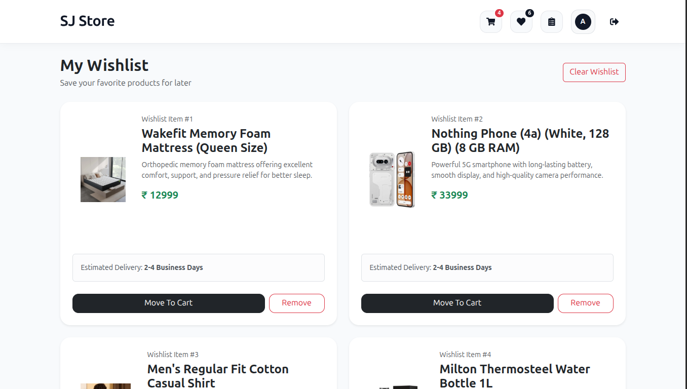
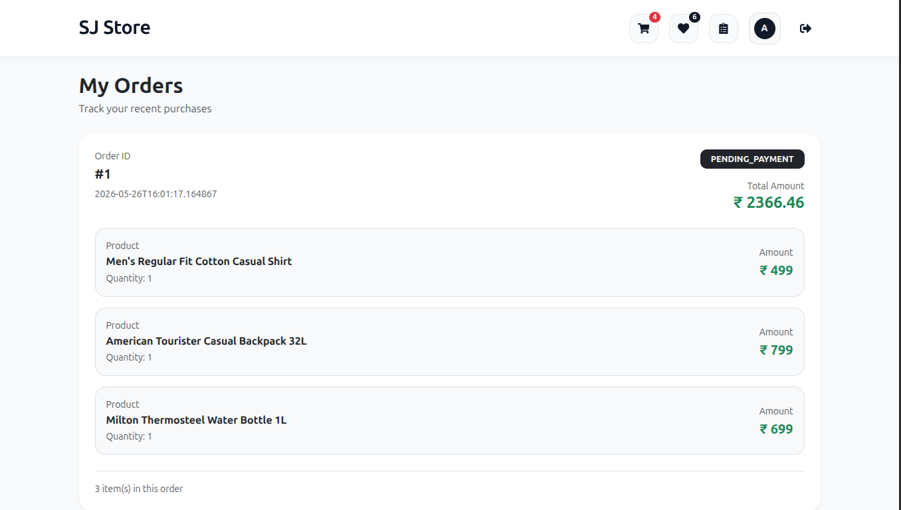
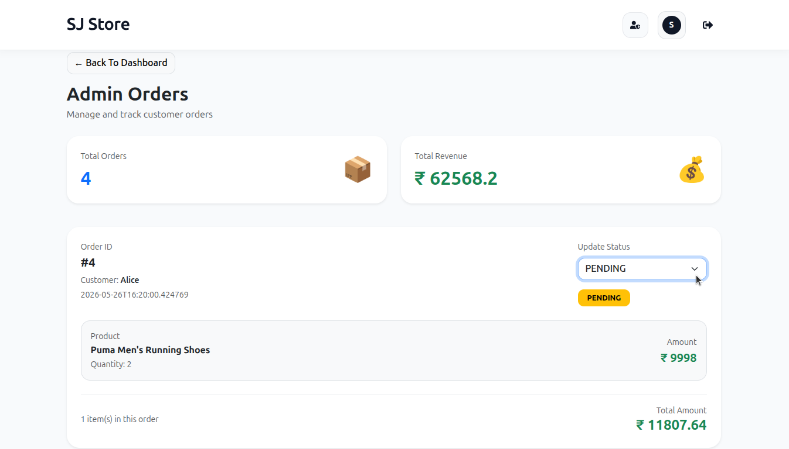
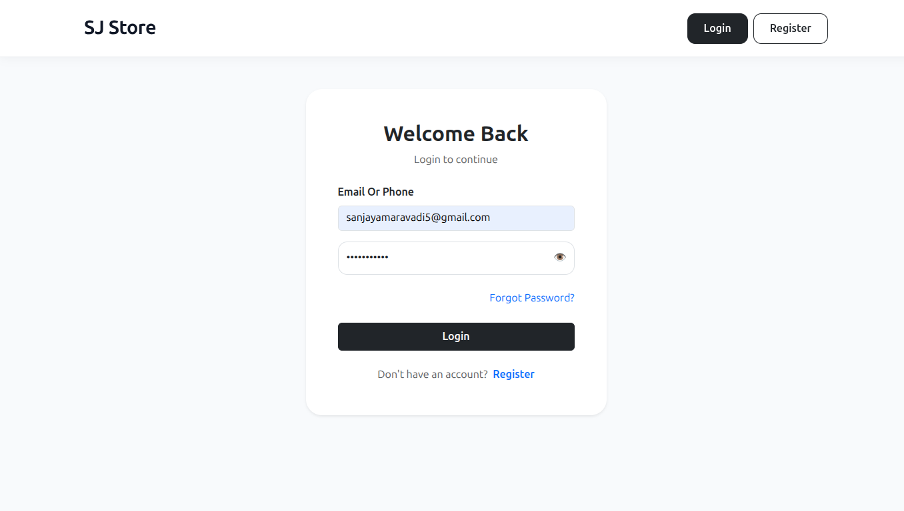
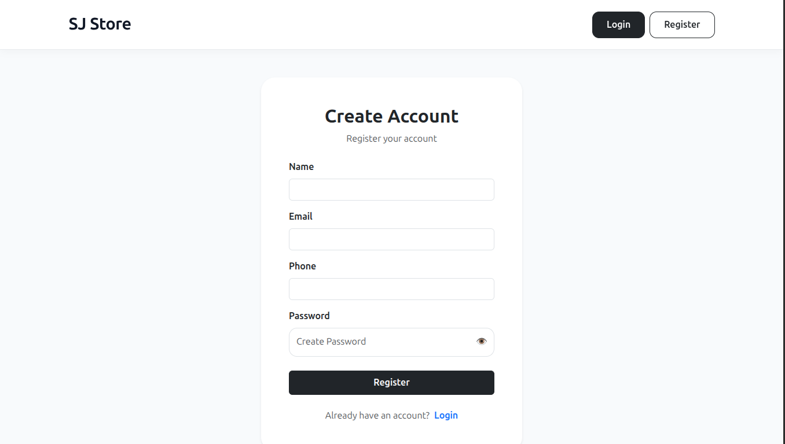
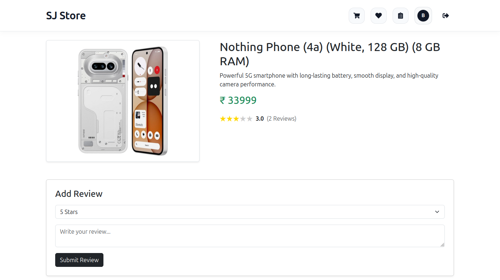

# 🛒 Full Stack E-Commerce Application

A modern full-stack E-Commerce Application built using:

- Spring Boot
- React + Vite
- MySQL
- JWT Authentication
- Razorpay Payment Gateway
- Bootstrap 5

This project demonstrates a complete real-world E-Commerce workflow including:

- Authentication & Authorization
- Product Management
- Cart & Wishlist
- Razorpay Payments
- Order Management
- Admin Dashboard
- Super Admin Features
- Dynamic Fee Management
- OTP Email Verification

---

# 🚀 Features

## 👤 User Features

- User Registration
- Login Authentication
- OTP Verification
- Forgot Password
- Reset Password
- Product Browsing
- Product Search
- Product Filtering
- Add To Cart
- Wishlist
- Save For Later
- Checkout
- Razorpay Payments
- Cash On Delivery
- Order History
- Product Reviews
- Profile Management

---

## 👑 Admin Features

- Add Products
- Update Products
- Delete Products
- Manage Categories
- Manage Orders
- Dynamic Fee Management
- Inventory Management

---

## 🔥 Super Admin Features

- Create Admins
- Promote Users
- Demote Admins
- Invite Admins
- Manage Admin Accounts

---

# 🧰 Tech Stack

| Technology | Purpose |
|---|---|
| Java 21 | Backend Language |
| Spring Boot | Backend Framework |
| Spring Security | Authentication |
| JWT | Authorization |
| Spring Data JPA | ORM |
| Hibernate | ORM |
| MySQL | Database |
| React | Frontend |
| Vite | Build Tool |
| Bootstrap 5 | UI |
| Axios | API Requests |
| Razorpay | Payment Gateway |

---

# 🏗️ System Architecture

```text
React Frontend
      ↓
REST APIs
      ↓
Spring Boot Backend
      ↓
Service Layer
      ↓
Repository Layer
      ↓
MySQL Database
````

---

# 📁 Project Structure

```text
project-root
├── backend
├── frontend
│   └── product-catalog
└── screenshots
```

---

# ⚙️ Backend Setup

```bash
cd backend
```

Run backend:

```bash
mvn spring-boot:run
```

Backend runs at:

```text
http://localhost:8080
```

---

# ⚛️ Frontend Setup

```bash
cd frontend/product-catalog
```

Install dependencies:

```bash
npm install
```

Run frontend:

```bash
npm run dev
```

Frontend runs at:

```text
http://localhost:5173
```

---

# 🔐 Roles

| Role        | Access                     |
| ----------- | -------------------------- |
| USER        | Shopping                   |
| ADMIN       | Product & Order Management |
| SUPER_ADMIN | Full System Access         |

---

# 📦 Main Modules

* Authentication
* Products
* Categories
* Cart
* Wishlist
* Checkout
* Payments
* Orders
* Reviews
* Admin Dashboard
* Admin Management
* Dynamic Fee Management

---

# 📸 Application Screenshots

## 🏠 Home Page


---

## 🛒 Cart Page


---

## 💳 Checkout Page


---

## ❤️ Wishlist Page



---

## 📦 Orders Page



---

## 👑 Admin Dashboard


---

## 📋 Manage Orders



---

## 🔐 Login Page



---

## 📝 Register Page



---

## 📄 Product Details Page



---

# 👨‍💻 Author

AMARAVADI SANJAY

---

# 📜 License

This project is for educational and learning purposes.
