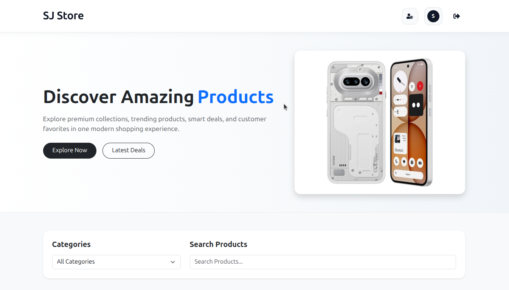
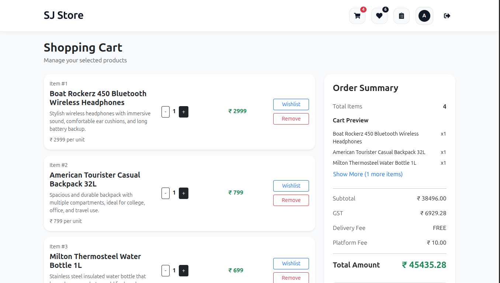
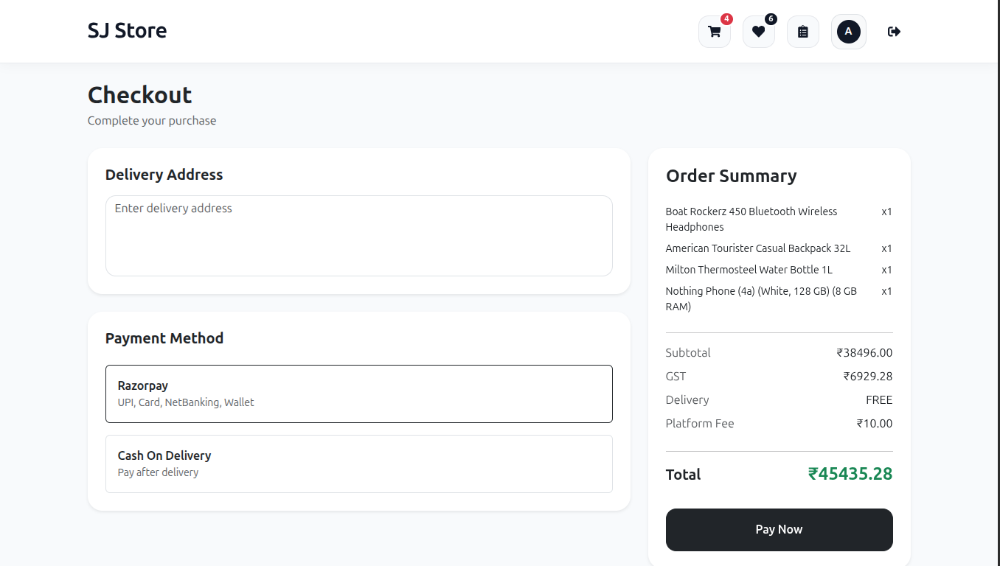
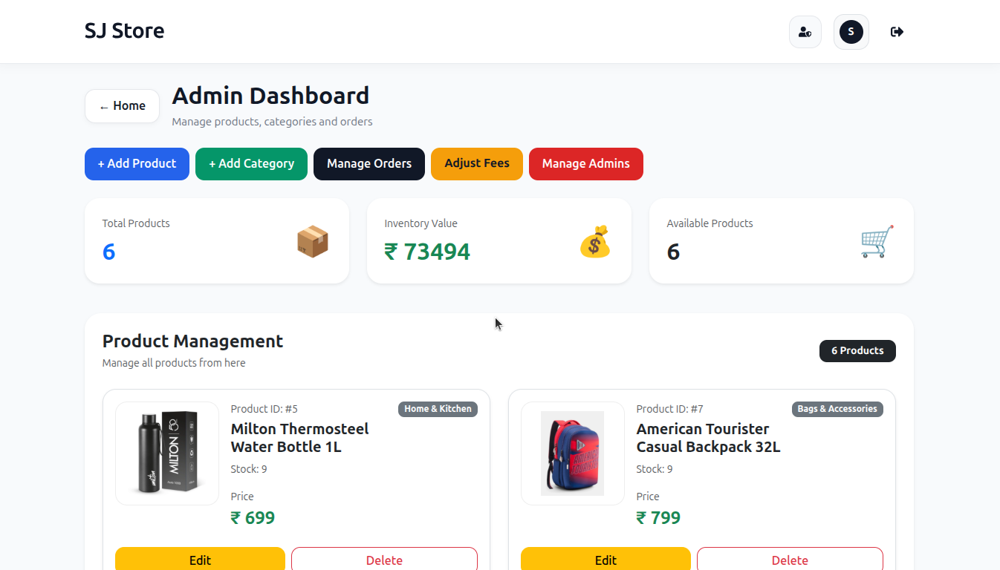

# ⚛️ E-Commerce Frontend (React + Vite)

Frontend for the Full Stack E-Commerce Product Catalog Application.

Built using:

- React
- Vite
- Bootstrap 5
- Axios
- React Router DOM
- React Hot Toast
- Framer Motion

---

# 🧰 Frontend Tech Stack

| Technology | Purpose |
|---|---|
| React | Frontend Library |
| Vite | Build Tool |
| Bootstrap 5 | UI Styling |
| Axios | API Calls |
| React Router DOM | Routing |
| React Hot Toast | Notifications |
| Framer Motion | Animations |

---

# 📁 Frontend Structure

```text
src
├── api
├── components
├── context
├── pages
├── routes
├── services
└── utils
````

---

# 📦 Install Dependencies

## Bootstrap

```bash
npm install bootstrap react-bootstrap
```

---

## Main Packages

```bash
npm install axios react-router-dom react-hot-toast framer-motion
```

---

## JWT Decode

```bash
npm install jwt-decode
```

---

## React Icons

```bash
npm install react-icons
```

---

## Stripe Test Package

```bash
npm install @stripe/stripe-js
```

---

# ▶️ Run Frontend

```bash
npm install
```

```bash
npm run dev
```

Frontend URL:

```text
http://localhost:5173
```

---

# 🖥️ Main Pages

| Page                | Description     |
| ------------------- | --------------- |
| HomePage            | Product Listing |
| ProductDetailsPage  | Product Details |
| CartPage            | Shopping Cart   |
| CheckoutPage        | Checkout        |
| WishlistPage        | Wishlist        |
| OrdersPage          | Orders          |
| LoginPage           | Login           |
| RegisterPage        | Register        |
| ForgotPasswordPage  | Forgot Password |
| ResetPasswordPage   | Reset Password  |
| ProfilePage         | User Profile    |
| AdminDashboard      | Admin Dashboard |
| AdminOrdersPage     | Manage Orders   |
| AdminManagementPage | Manage Admins   |
| AdminSettingsPage   | Adjust Fees     |

---

# ✨ Frontend Features

* Responsive UI
* Modern Design
* Protected Routes
* Cart System
* Wishlist
* Razorpay Integration
* Dynamic Fee Display
* Toast Notifications
* Admin Dashboard

---

# 🔐 Authentication

Frontend uses:

* JWT Authentication
* Protected Routes
* Admin Route Protection
* Super Admin Protection

---

# 📸 Frontend Screenshots

## 🏠 Home Page



---

## 🛒 Cart Page



---

## 💳 Checkout Page



---

## 👑 Admin Dashboard



---

# 👨‍💻 Author

AMARAVADI SANJAY